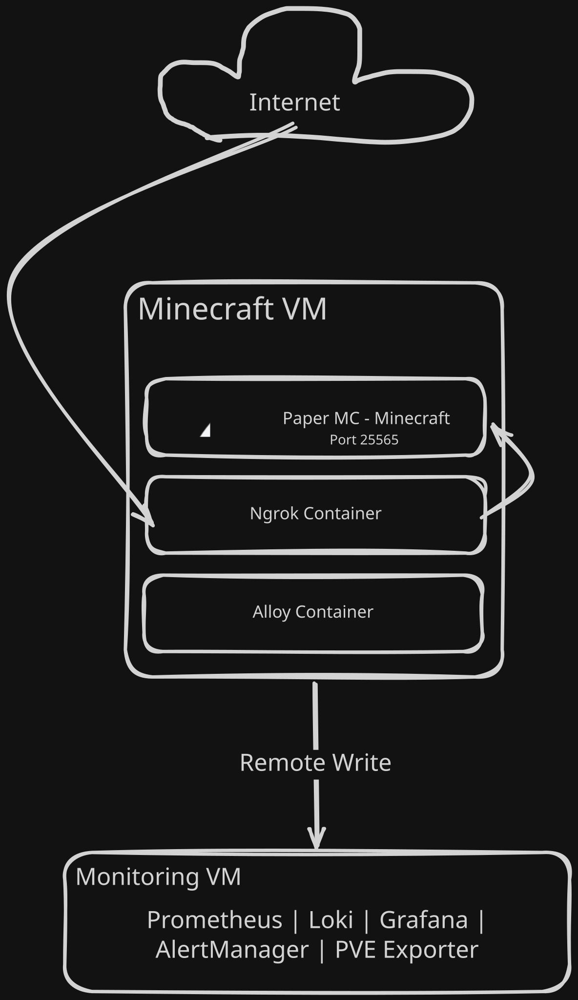

# Minecraft Server — PaperMC + ngrok

Ansible-deployed Minecraft server (PaperMC) with an ngrok TCP tunnel for external access, running on a VM that was provisioned from Packer templates via OpenTofu.

- Corresponding post: [Phase V — The 2 Week Minecraft Phase](https://medium.com/@0xA1M/phase-v-the-2-week-minecraft-phase-00bf8505cb46)

## Overview

A single `ansible-playbook` command provisions everything:

1. **PaperMC** (`itzg/minecraft-server:latest`) — an optimized Minecraft Java server fork with Aikar's G1GC flags, running on port 25565.
2. **ngrok** (`ngrok/ngrok:latest`) — a TCP tunnel that exposes the server to the internet without opening firewall ports or wrestling with CGNAT.

Both run as Docker containers on the same VM. The ngrok authtoken is stored encrypted in Ansible Vault and injected at deploy time. If the VM also runs Grafana Alloy from Phase IV, metrics and logs automatically flow to the monitoring stack — no extra config needed.

## Architecture



## Prerequisites

1. A VM on your Proxmox host with Docker installed.
2. SSH access to the VM (passwordless, via `~/.ssh/config`).
3. Ansible installed on your control node (or use `devbox`).
4. `community.docker` Ansible collection:
   ```bash
   ansible-galaxy collection install -r requirements.yml
   ```
5. A [ngrok account](https://dashboard.ngrok.com/signup) and authtoken.
6. Ansible Vault setup for storing that token.

## Getting an ngrok Auth Token

1. Sign up at [ngrok.com](https://dashboard.ngrok.com/signup) — free tier works fine.
2. Go to [Your Authtokens](https://dashboard.ngrok.com/authtokens).
3. Copy your token (looks like `2hFgH...`).
4. Encrypt it with Ansible Vault (next section).

## Ansible Vault Setup

Secrets live in `group_vars/minecraft/vault.yml`, encrypted with Ansible Vault.

### 1. Create the vault password file

```bash
echo "your-vault-password" > .vault_pass
chmod 600 .vault_pass
```

Add `.vault_pass` to `.gitignore` so it never gets committed.

### 2. Create the vault

```bash
ansible-vault create group_vars/minecraft/vault.yml
```

Add the ngrok authtoken:

```yaml
ngrok_auth_token: "2hFgH..."
```

To edit later: `ansible-vault edit group_vars/minecraft/vault.yml`.

### 3. Verify it works

```bash
ansible-vault view group_vars/minecraft/vault.yml
```

If you'd rather not use a password file, remove `vault_password_file` from `ansible.cfg` and pass `--ask-vault-pass` when running the playbook.

## Directory Structure

```
05 - minecraft/
├── ansible.cfg                  # Inventory, vault, host key checking
├── docker-compose.yml           # Defines mc + ngrok containers
├── inventory.ini                # [minecraft] host group
├── requirements.yml             # Required Ansible collections
├── templates/
│   └── ngrok.yml.j2             # Jinja2 template for ngrok config
├── group_vars/
│   └── minecraft/
│       └── vault.yml            # Encrypted ngrok authtoken
├── playbooks/
│   └── deploy-minecraft.yml     # The deployment playbook
├── POST.md                      # Blog post
└── README.md                    # This file
```

## Inventory

Edit `inventory.ini` with your VM's details:

```ini
[minecraft]
mc-vm ansible_host=10.0.0.115 ansible_user=ubuntu
```

## Configuration

### `docker-compose.yml`

```yaml
services:
  mc:
    image: itzg/minecraft-server:latest
    tty: true
    stdin_open: true
    ports:
      - "25565:25565"
    environment:
      EULA: "TRUE"
      TYPE: "PAPER"
      MEMORY: "1024M"
      MAX_PLAYERS: "5"
      ONLINE_MODE: "false"
      USE_AIKAR_FLAGS: "true"
      DIFFICULTY: "3"
      ENABLE_ROLLING_LOGS: "true"
      LOG_TIMESTAMP: "true"
    volumes:
      - "./data:/data"

  ngrok:
    container_name: minecraft-ngrok
    image: ngrok/ngrok:latest
    restart: unless-stopped
    command:
      - "start"
      - "--all"
      - "--config"
      - "/etc/ngrok.yml"
    volumes:
      - ./configs/ngrok.yml:/etc/ngrok.yml
```

The important bits: `TYPE: PAPER` gets you the optimized PaperMC fork, `ONLINE_MODE: false` lets cracked clients connect (needed since ngrok TCP tunnels can't do SRV records), and `container_name: minecraft-ngrok` gives the ngrok container a fixed name so the playbook can grep its logs reliably.

### `templates/ngrok.yml.j2`

```yaml
version: 3

agent:
  authtoken: "{{ ngrok_auth_token }}"
  log: stdout
  log_level: "info"
  log_format: "logfmt"
  update_check: false

endpoints:
  - name: Minecraft
    url: tcp://
    upstream:
      url: mc:25565
```

Without a valid authtoken, ngrok refuses to start. `log: stdout` pipes logs to stdout so `docker logs minecraft-ngrok` captures the tunnel URL. The `url: tcp://` creates a raw TCP tunnel — that's what Minecraft's protocol needs.

### How secrets flow

```
group_vars/minecraft/vault.yml  →  templates/ngrok.yml.j2  →  /opt/minecraft/configs/ngrok.yml
  └── ngrok_auth_token              {{ ngrok_auth_token }}         authtoken: "2hFgH..."
```

The vault password lives in `.vault_pass` (gitignored). The template task in the playbook uses `no_log: true` so the token never appears in Ansible output.

## Running the Playbook

```bash
ansible-playbook playbooks/deploy-minecraft.yml
```

If you skipped the vault password file:

```bash
ansible-playbook playbooks/deploy-minecraft.yml --ask-vault-pass
```

### What it does

1. Creates `/opt/minecraft` on the target VM.
2. Copies `docker-compose.yml` over.
3. Creates `configs/` and `data/` subdirectories.
4. Renders `ngrok.yml` from the vault secret.
5. Runs `docker compose up -d` with `pull: always` to grab the latest images.
6. Polls `docker logs minecraft-ngrok` every 2 seconds (up to 15 tries) until the tunnel URL appears.
7. Prints the URL so you can copy-paste it to friends.

### Expected output

```
PLAY [Provision minecraft VM] **************************************************

TASK [Gathering Facts] *******************************************************
ok: [mc-vm]

TASK [Ensure minecraft directory exists] *************************************
changed: [mc-vm]

TASK [Copy docker-compose.yml] ***********************************************
changed: [mc-vm]

TASK [Create required directories] *******************************************
changed: [mc-vm] => (item=configs)
changed: [mc-vm] => (item=data)

TASK [Template ngrok.yml from vault] *****************************************
changed: [mc-vm]

TASK [Deploy minecraft server + ngrok with docker compose] *******************
changed: [mc-vm]

TASK [Wait for Ngrok tunnel and get public URL] ******************************
ok: [mc-vm]

TASK [Show Minecraft server address] *****************************************
ok: [mc-vm] => {
    "msg": "Minecraft server accessible at 5.tcp.eu.ngrok.io:21903"
}

PLAY RECAP *******************************************************************
mc-vm : ok=8 changed=5 unreachable=0 failed=0 skipped=0 rescued=0 ignored=0
```

A couple things to keep in mind: the playbook skips Docker installation — it assumes Docker is already on the VM (Phase IV's `register-vm` playbook handles that). And `remove_orphans: true` means if you change the compose file, old containers get cleaned up automatically.

## Verifying the Deployment

```bash
# Check both containers are running
ssh ubuntu@10.0.0.115 "docker ps"

# Look for the tunnel URL in ngrok logs
ssh ubuntu@10.0.0.115 "docker logs minecraft-ngrok --tail 20"

# Check if the Minecraft server finished starting
ssh ubuntu@10.0.0.115 "docker logs mc --tail 10"
# Look for: Done (X.XXXs)! For help, type "help"
```

## Useful Commands

### On the Minecraft VM

| Command | What It Does |
|---------|-------------|
| `docker compose logs -f` | Follow logs from both containers |
| `docker logs -f mc` | Follow Minecraft server log |
| `docker logs mc \| grep -i "joined"` | See who's joining |
| `docker exec -i mc rcon-cli list` | List connected players (needs RCON) |
| `docker exec -i mc rcon-cli say Hello!` | Broadcast a message |
| `docker compose restart mc` | Restart the server |
| `docker compose down` | Stop everything (world persists in `./data`) |

### On the control node

| Command | What It Does |
|---------|-------------|
| `ansible-vault view group_vars/minecraft/vault.yml` | Decrypt and view the vault |
| `ansible-vault edit group_vars/minecraft/vault.yml` | Edit the vault |
| `ansible-playbook playbooks/deploy-minecraft.yml --check` | Dry-run |

## Troubleshooting

| Symptom | Likely Cause | Fix |
|---------|-------------|-----|
| ngrok logs `No such command: start` | Config file is missing or has bad syntax | Check `configs/ngrok.yml` is valid YAML, then re-run the playbook |
| ngrok doesn't connect, auth errors | Invalid or missing authtoken | `ansible-vault view group_vars/minecraft/vault.yml` to verify, then re-deploy |
| Minecraft log is empty after compose | Server is still generating the world (first boot takes 30–60s) | Wait. It's downloading PaperMC and building spawn chunks. |
| Players see `Connection refused` | Tunnel hasn't come up yet, or it expired | Check ngrok logs for `url=`. Restart if needed. |
| Players see `Connection timed out` | Free tier rate limit (1 connection/min) | Wait a minute, or upgrade to a paid plan. |
| IP changed after reboot | Free tier assigns random TCP ports each restart | Share the new URL. Paid plans get reserved addresses. |
| Ansible fails with `timeout waiting for privilege escalation` | User doesn't have passwordless sudo | Check `/etc/sudoers` on the VM. |
| `community.docker` task fails | Collection not installed | `ansible-galaxy collection install -r requirements.yml` |
| `vault was not found` | Vault password file is missing or wrong | Check `.vault_pass` exists and `ansible.cfg` points to the right path. |

## Customization

### Change server properties

Stop the server, edit `data/server.properties` on the VM, and restart:

```bash
ssh ubuntu@10.0.0.115 "sed -i 's/difficulty=hard/difficulty=normal/' /opt/minecraft/data/server.properties"
ssh ubuntu@10.0.0.115 "docker compose restart mc"
```

### Install plugins

The `data/` directory maps to `/data` inside the container. Drop `.jar` files into `data/plugins/`:

```bash
ssh ubuntu@10.0.0.115 "mkdir -p /opt/minecraft/data/plugins"
scp my-plugin.jar ubuntu@10.0.0.115:/opt/minecraft/data/plugins/
ssh ubuntu@10.0.0.115 "docker compose restart mc"
```

### Make backups

```bash
ssh ubuntu@10.0.0.115 "tar czf /tmp/minecraft-world-$(date +%Y%m%d-%H%M).tar.gz /opt/minecraft/data/world"
```

Or stop the server first for a consistent snapshot:

```bash
ssh ubuntu@10.0.0.115 "docker compose stop mc && tar czf /tmp/minecraft-world-backup.tar.gz /opt/minecraft/data/world && docker compose start mc"
```

### Increase RAM

Edit `docker-compose.yml`, change `MEMORY: "1024M"` to `MEMORY: "2048M"`, then re-run the playbook.

## What's Not Included

- **RCON** — remote console. Add `ENABLE_RCON: "true"` and `RCON_PASSWORD: "your-password"` to the compose file if you need it.
- **Whitelist** — since `ONLINE_MODE: "false"`, anyone can join. Add `WHITELIST: "player1,player2"` and `ENABLE_WHITELIST: "true"` to lock it down.
- **Backup automation** — no cron job included. The `data/` directory can be snapshotted or rsynced manually.
- **Geyser (Bedrock cross-play)** — the `itzg/minecraft-server` image supports it. Install the Geyser plugin in `data/plugins/`.
- **Static ngrok address** — free tier assigns a random TCP port on every restart. Paid plans let you reserve one.
- **Alternative tunnels** — Cloudflare Tunnel, FRP, or direct port forwarding work too if ngrok isn't your thing.

## References

- [Blog Post: Phase V — The 2 Week Minecraft Phase](https://medium.com/@0xA1M/phase-v-the-2-week-minecraft-phase-00bf8505cb46)
- [itzg/minecraft-server Docker Image Docs](https://docker-minecraft-server.readthedocs.io/en/latest/)
- [ngrok Agent Config v3](https://ngrok.com/docs/agent/config/v3/)
- [Aikar's G1GC Flags for Minecraft](https://aikar.co/2018/07/02/tuning-the-jvm-g1gc-garbage-collector-flags-for-minecraft/)
- [Ansible Vault Docs](https://docs.ansible.com/ansible/latest/cli/ansible-vault.html)
- [community.docker Collection](https://docs.ansible.com/ansible/latest/collections/community/docker/)
- [Proxmox Private Cloud (repo)](https://github.com/0xA1M/proxmox-private-cloud)
