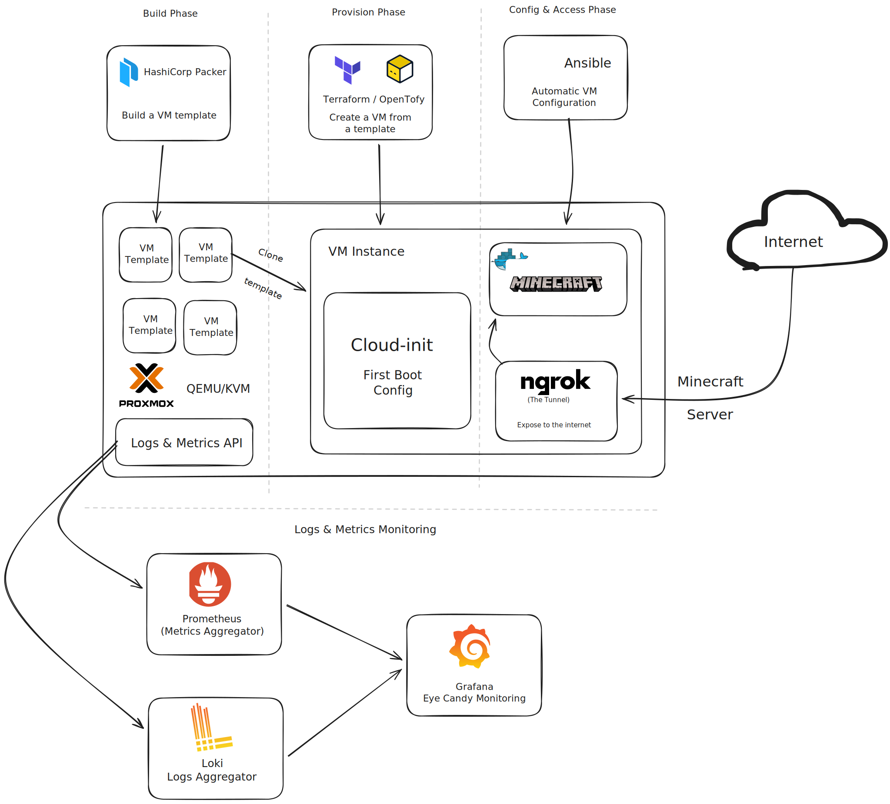

# Proxmox Private Cloud



**Build and operate a local private cloud using Proxmox VE 9.1 (latest as of December 2025), with fully automated VM image creation and lifecycle management via Packer and Terraform/OpenTofu, layered configuration using cloud-init and Ansible, observability with Grafana/Prometheus/Loki, and optional external exposure via Ngrok (including a Docker-based Minecraft server demo).**

This repo accompanies my blog series on Medium:  
[How to Build a Local Private Cloud](https://medium.com/@0xA1M) (starting with **Part I: Proxmox**).

## Overview & Goals

- Deploy a **production-ready Proxmox environment** with KVM/QEMU virtualization.
- Automate VM image creation with **Packer** and provisioning with **Terraform/OpenTofu**.
- Configure VMs using **Ansible** (idempotent management).
- Implement observability with **Grafana, Prometheus, and Loki**.
- Securely expose services externally using **Ngrok** (free tier), including a simple **Minecraft Java Edition server** in Docker.

## Project Structure

```
proxmox-private-cloud/
├── core-setup/                     # Proxmox installation & basics
│   ├── install-notes.md            # Detailed steps (from blog Part I and beyond)
│   └── post-install.sh             # extremeshok's optimization script
├── provisioning/                   # Packer + Terraform/OpenTofu
│   ├── packer/                     # Templates (.pkr.hcl files)
│   └── terraform/                  # Modules, main.tf, variables
├── configuration/                  # Ansible
│   └── ansible/                    # Playbooks, roles, inventory
├── observability/                  # Monitoring stack
│   ├── docker-compose.yml
│   └── configs/                    
├── remote-access/                  # Ngrok + Minecraft demo
│   ├── ngrok/                      # Configs & scripts
│   └── minecraft/                  # Docker Compose for Java Edition server
├── README.md                       # This file
├── LICENSE                         # MIT
└── .gitignore
```

## Contributing

Feel free to open issues, suggest improvements, or PR configs/scripts. This is a learning project.

## License

[MIT License](LICENSE) – use, modify, share freely.
