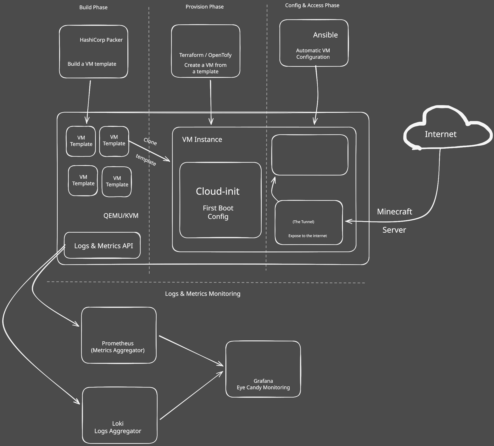

# Proxmox Private Cloud



**Build and operate a local private cloud on Proxmox VE, from bare-metal hypervisor setup to full-stack observability — all automated with Packer, OpenTofu, and Ansible.**

This repo walks you through the whole journey: harden a Proxmox host, crank out standardized VM images with Packer, spin them up with OpenTofu, configure everything with Ansible, deploy a Minecraft server with a public ngrok tunnel, and keep an eye on it all with Grafana, Prometheus, Loki, and Alloy. Each phase has a matching Medium blog post if you want the backstory.

---

## Quick Start with Devbox

This project uses [devbox](https://www.jetify.com/devbox) to manage tooling. All required tools (Packer, OpenTofu, Ansible) are installed automatically.

```bash
# Enter the devbox shell (installs all packages)
devbox shell

# Or run individual commands without entering the shell
devbox run help
```

### Available Devbox Commands

| Command | Phase | Description |
|---------|-------|-------------|
| `devbox run help` | — | Show all available commands |
| `devbox run packer:build-iso` | II | Build a VM template from an ISO image |
| `devbox run packer:build-clone` | II | Build a VM template from an existing VM |
| `devbox run tofu:plan` | II | Preview OpenTofu infrastructure changes |
| `devbox run tofu:apply` | II | Apply OpenTofu infrastructure |
| `devbox run ansible:deploy-minecraft` | V | Deploy Minecraft server + ngrok tunnel |
| `devbox run ansible:setup-monitoring` | IV | Deploy the monitoring stack (set IP in inventory.ini first) |
| `devbox run ansible:register-vm` | IV | Register a VM with Alloy (`-l IP` to target) |
| `devbox run ansible:unregister-vm` | IV | Remove Alloy from a VM (`-l IP` to target) |

Without devbox, run `./setup-env.sh` to install Packer, OpenTofu, and Ansible manually.

> **Before deploying** — replace all `CHANGEME_*` placeholders across the repo
> with your actual values (IPs, API tokens, passwords). They appear in:
> `04 - observability & monitoring/configs/`, `04 - observability & monitoring/ansible/`,
> `04 - observability & monitoring/terraform/`, `02 - provisioning/02 - OpenTofu-Terraform/variables.tf`,
> and `devbox.json`.

---

## Project Structure

```
proxmox-private-cloud/
├── 01 - core-setup/                       # Phase I — Proxmox installation & hardening
│   ├── post-install.sh                    #   extremeshok's optimization script
│   └── README.md                          #   Setup guide & production recommendations
├── 02 - provisioning/                     # Phase II — VM image creation & provisioning
│   ├── 01 - Packer/                       #   Packer templates (ISO + Clone)
│   │   ├── ISO/                           #     Build from ISO with cloud-init
│   │   ├── Clone/                         #     Build from existing template
│   │   └── README.md
│   └── 02 - OpenTofu-Terraform/           #   Infrastructure as Code for VM deployment
│       ├── main.tf                        #     VM resource definitions
│       ├── provider.tf                    #     Proxmox provider config
│       ├── variables.tf                   #     Input variables
│       └── README.md
├── 03 - configuration/                    # Phase III — Ansible configuration management
│   └── ansible/
│       ├── main.yaml                      #   Playbook orchestrator
│       ├── playbooks/                     #   init, users, security, minecraft
│       └── README.md
├── 04 - observability & monitoring/        # Phase IV — Observability stack
│   ├── ansible/                           #   Playbooks for monitoring VM & target VMs
│   ├── configs/                           #   Grafana, Prometheus, Loki, Alloy configs
│   ├── terraform/                         #   OpenTofu for the monitoring VM itself
│   ├── docker-compose.yml                 #   Monitoring services definition
│   └── README.md
├── 05 - minecraft/                         # Phase V — Minecraft + ngrok tunnel
├── .assets/                               # Project diagrams & assets
│   ├── Architecture.svg
│   ├── ngrok_mc_tunnel.svg
│   └── Observation_Architecture.svg
├── devbox.json                            # Devbox package & script configuration
├── devbox.lock                            # Devbox lockfile
├── setup-env.sh                           # Legacy environment setup script
├── README.md                              # This file
└── LICENSE                                # MIT License
```

---

## Phase Summaries

### Phase I — Core Setup

**Production-ready Proxmox foundation.**

Hardens a fresh Proxmox VE 9.1 install — repos, firewall, 2FA, SSH, and extremeshok's optimization script. Also covers post-install niceties like timezone, DNS, and email notifications.

**Directory:** [`01 - core-setup/`](./01%20-%20core-setup/README.md)

---

### Phase II — Provisioning (Packer + OpenTofu)

**Automated VM image creation and infrastructure-as-code.**

Packer builds standardized VM templates from ISO or existing VMs using cloud-init. OpenTofu (Terraform-compatible) deploys VMs from those templates with reproducible config. Both use API token auth and ship with QEMU Guest Agent.

**Directories:**
- [`02 - provisioning/01 - Packer/`](./02%20-%20provisioning/01%20-%20Packer/README.md)
- [`02 - provisioning/02 - OpenTofu-Terraform/`](./02%20-%20provisioning/02%20-%20OpenTofu-Terraform/README.md)

---

### Phase III — Configuration (Ansible)

**Idempotent config management for every VM.**

Modular playbooks handle system init, user management, security hardening, and app deployment. Security includes SSH key-only auth, fail2ban, and UFW with default-deny. Secrets live in Ansible Vault.

**Directory:** [`03 - configuration/ansible/`](./03%20-%20configuration/ansible/README.md)

---

### Phase IV — Observability & Monitoring

**Full-stack observability with Grafana, Prometheus, Loki, and Grafana Alloy.**

Alloy runs as a unified collector on every target VM (replacing separate Node Exporter, cAdvisor, and Promtail agents). Prometheus handles metrics and alerting, Loki absorbs logs with 30-day retention, and PVE Exporter bridges Proxmox host metrics into the mix. Alertmanager fires notifications to Discord, and Grafana dashboards are auto-provisioned. All secrets are vaulted.

**Directory:** [`04 - observability & monitoring/`](./04%20-%20observability%20&%20monitoring/README.md)

---

### Phase V — Minecraft Server + ngrok Tunnel

A Minecraft Java Edition server running in Docker with a Paper server type, cracked auth (online_mode=false), and a sidecar ngrok container that punches a public TCP tunnel so anyone can join. The playbook waits for the tunnel to come up and prints the address at the end — no hunting through logs. It lives on the same VM that runs Alloy from Phase IV, so the observability stack picks it up automatically.

**Directory:** [`05 - minecraft/`](./05%20-%20minecraft/README.md)

---

## References

This project accompanies a multi-part blog series on Medium:

- [How to Build a Local Private Cloud — Part I: Proxmox](https://medium.com/@0xA1M/how-to-build-a-local-private-cloud-part-i-proxmox-f118b146ebd8)
- [Phase II — Part 1: Automating VM Provisioning in Proxmox w/ Packer](https://medium.com/@0xA1M/phase-ii-part-1-automating-vm-provisioning-in-proxmox-w-packer-aafdd4231db2)
- [Phase II — Part 2: Automating VM Provisioning in Proxmox w/ Terraform/OpenTofu](https://medium.com/@0xA1M/phase-ii-part-2-automating-vm-provisioning-in-proxmox-w-terraform-opentofu-ec14ad931bfb)
- [Phase III — Automating VM Configuration Using Ansible](https://medium.com/@0xA1M/phase-iii-automating-vm-configuration-using-ansible-a51956395590)
- [Phase IV — Your Own Little Palantír w/ LGTM Stack](https://medium.com/@0xA1M/phase-vi-your-own-little-palantir-w-lgtm-stack-fcdeb8a40304)
- [Phase V — The 2 Week Minecraft Phase](https://medium.com/@0xA1M/phase-v-the-2-week-minecraft-phase-00bf8505cb46)

---

## License

[MIT License](LICENSE) — use, modify, share freely.
